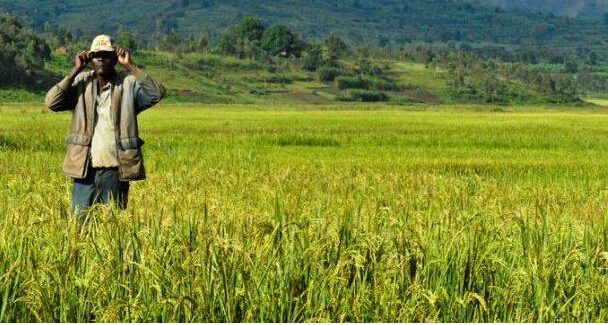

# **COMP8260 Workshop4 Group3 Project**
## Agriculture in Africa
> For more information, please visit our [Landing Page](https://agriculture-in-africa.webflow.io/)    

   
retrieved from [http://blog.sina.com.cn/s/blog_14844c1ce0102w1th.html](http://blog.sina.com.cn/s/blog_14844c1ce0102w1th.html)
    
## Team Members
* u7173507 **Qixuan Ren**: Technical Support | Editor   
* u7172190 **Xi Chen**: Technical Support | Editor   
* u7078518 **Yifei Tao**: Technical Support | Editor   
* u7194943 **Yuexin Chen**: Technical Support | Coordinator 
* u7213046 **Fei wu**: Technical Support | Coordinator

## Introduction
Agriculture is the most important sector in most African countries. It contributes about **30%** of the continent GDP and about 
**50%** of its exports. Of the 1 billion people in Africa, **70%** depend on agriculture for their livelihood.     
Nowadays, with the continuous growth of population, agrotechnique is also in constant innovation, many new technologies 
and data are also applied in farming and production, to promote the sustainable development of agriculture.
This project aims to use technological innovations such as ... (Earth observation data; Digital Earth for Africa) 
to help African governments and farmers better develop agricultural activities and make decisiions.

## Project Overview
To analyze how Digital Earth Africa uses innovative technologies such as climate monitoring and crop
health analysis to help governments and farmers better develop agricultural activities and make decisions.

## Project Documents
* [Project Overview]()
* [Team Charter]()
* [Decision Log]()
* [Stakeholder Analysis](https://gitlab.cecs.anu.edu.au/u7172190/comp8260-workshop4-group3/-/blob/master/Project%20Documents/Design%20Thinking/Stakeholder%20analysis.pdf)
* [Mapping relationships between issues and stakeholders](https://gitlab.cecs.anu.edu.au/u7172190/comp8260-workshop4-group3/-/blob/master/Project%20Documents/Design%20Thinking/Relationships%20between%20Issues%20and%20Stakeholders.pdf)