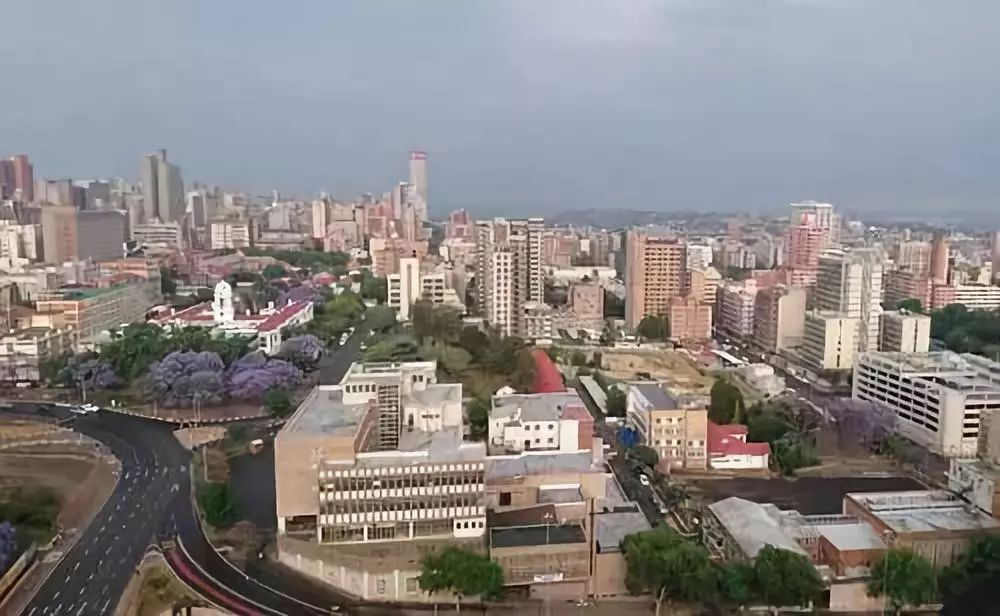

# **COMP8260 Workshop4 Group3 Project**
> For more information, please visit our [Landing Page](https://urbanisation-in-africa.webflow.io/)    

   
retrieved from [http://5b0988e595225.cdn.sohucs.com/images/20190119/5b2918aa9b93401ab90f230cd95975c8.jpeg](http://5b0988e595225.cdn.sohucs.com/images/20190119/5b2918aa9b93401ab90f230cd95975c8.jpeg)
    
## Team Members
* u7173507 **Qixuan Ren**: Technical Support | Editor   
* u7172190 **Xi Chen**: Technical Support | Editor   
* u7078518 **Yifei Tao**: Technical Support | Editor   
* u7194943 **Yuexin Chen**: Technical Support | Coordinator 

## Introduction
Urbanization rate is an important indicator of urban sustainability. Rapid, unplanned urbanization may 
lead to adverse social, economic and environmental consequences due to inadequate and overburdened infrastructure 
and services. However, there are many challenges to urban sustainability in Africa. 
This project aims to use technological innovations such as data cubes (Earth observation data; Digital Earth for Africa) 
to help Africa build more sustainable and prosperous social ecosystems for urbanization.

## Project Overview
Government and industry need to use some technological innovation platforms to collect information such as the trend of urbanization and the state of population flow 
in order to play a role in regular urban surveillance.

## Project Documents
* [Project Overview]()
* [Team Charter]()
* [Decision Log]()
